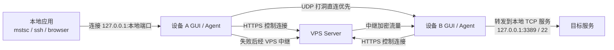

# MiniPunch 极简打洞软件设计方案

## 1. 目标与约束

本方案对应以下明确目标：

- 支持 Windows / macOS / Linux
- 网络规模很小，最多 5 台设备
- 必须有 GUI
- 使用者可以提供自己的 VPS
- 可以访问其他设备上的 TCP 端口，例如 `22`、`3389`
- 优先追求极简和安全，而不是大而全

本方案的核心判断是：

- 你的需求更接近“安全地访问远端 TCP 服务”，而不是“完整替代企业级 VPN”
- 因为节点数极少，所以可以接受架构上偏集中式
- 因为你有 VPS，所以应该把复杂性尽量收敛到 VPS 上
- 因为要极简，所以 MVP 不建议先做虚拟网卡、子网路由、广播发现、文件传输等扩展能力

## 2. 产品形态

建议将产品拆成两个部分：

- `minipunch-server`
  运行在 VPS 上，负责控制面、打洞协调、候选地址交换、失败时的中继转发
- `minipunch-desktop`
  运行在 Windows / macOS / Linux 上，包含 GUI 和后台 Agent

MVP 不做完整虚拟局域网，而是做“服务级连接”：

- 某台设备发布一个本地 TCP 服务，比如 `127.0.0.1:3389`
- 另一台设备在本机生成一个访问入口，比如 `127.0.0.1:13389`
- 用户最终把 RDP/SSH 客户端连到这个本地入口
- Agent 在后台把这条 TCP 连接安全地转发到目标设备

这个模式满足你的核心用途，同时比全量 VPN 更简单，也更安全。

## 3. 为什么不先做完整 VPN

完整 VPN 当然也能解决问题，但对当前目标来说并不划算。

不优先做 VPN 的原因：

- 需要处理 TUN/TAP 或 WireGuard 虚拟网卡，跨平台复杂度明显上升
- 会引入路由、DNS、子网冲突、系统权限等额外问题
- GUI 配置和用户理解成本更高
- 你的场景本质上只是访问少量 TCP 端口，不需要整个网段互通

因此，MVP 应聚焦为：

- “发布 TCP 服务”
- “授权谁能访问”
- “在其他设备创建本地访问端口”

这已经足够覆盖 `SSH`、`RDP`、内部 Web 控制台、数据库管理口等典型场景。

## 4. 总体架构

### 4.1 控制面

控制面全部走 `HTTPS + WebSocket`，负责：

- 设备注册和上线心跳
- Join Token 校验
- 设备列表同步
- 发布服务元数据同步
- ACL 下发
- NAT 外网地址探测结果上报
- 直连失败后的中继协调

### 4.2 数据面

数据面只承载真正的 TCP 业务流量，支持两种路径：

- 直连路径：双方通过 UDP 打洞建立点对点传输
- 中继路径：直连失败时，双方都出站连接 VPS，经中继转发

### 4.3 服务模型

每个 TCP 服务由以下元数据描述：

- 服务名称
- 目标设备 ID
- 目标本地地址，默认 `127.0.0.1:port`
- 协议类型，MVP 仅 `TCP`
- 授权访问的设备列表

远端访问时不直接暴露系统全局端口，而是在请求方本机创建一个回环监听端口，例如：

- `127.0.0.1:10022 -> devbox:22`
- `127.0.0.1:13389 -> office-pc:3389`

这样用户使用习惯很直观，而且默认不会把服务再次暴露到本地局域网。

## 5. 典型使用流程

### 5.1 首次建网

1. 用户在 VPS 上部署 `minipunch-server`
2. 服务端生成一个管理员初始化 Token
3. 第一台设备安装客户端并输入 `Server URL + Token`
4. 客户端本地生成长期身份密钥并完成注册
5. 第一台设备可以继续生成短时 Join Token，让其他 4 台设备加入

### 5.2 发布服务

1. 用户在 GUI 中选择“发布服务”
2. 填写名称，例如 `Office RDP`
3. 填写目标端口，例如 `3389`
4. 选择监听目标，默认 `127.0.0.1:3389`
5. 选择允许访问的设备
6. 服务信息提交到 VPS 控制面

### 5.3 访问服务

1. 用户在 GUI 中看到远端设备公开给自己的服务
2. 点击“创建本地入口”
3. 客户端选择本地监听端口，例如 `13389`
4. Agent 先尝试与目标设备打洞
5. 如果直连成功，后续流量走点对点
6. 如果直连失败，自动切换到 VPS 中继
7. 用户只需要把 RDP/SSH 客户端连到 `127.0.0.1:13389`

## 6. 网络与协议设计

### 6.1 端口建议

VPS 默认只开放少量端口：

- `443/TCP`
  控制面 HTTPS、GUI 配置、备用中继入口
- `443/UDP`
  UDP 打洞、直连探测、可选的高性能数据通道
- `80/TCP`
  仅用于证书签发，可选

这样部署最简单，也更容易穿透严格网络环境。

### 6.2 NAT 打洞策略

客户端启动后维持一个长期 UDP socket，并周期性向 VPS 发 keepalive。VPS 记录：

- 设备当前外网 IP 和端口
- 最近活跃时间
- NAT 类型的粗略判断

当 A 访问 B 时：

1. A 向 VPS 请求 B 的候选地址
2. VPS 同时通知 B 准备接入
3. A、B 在短时间窗口内同时向彼此候选地址发送握手包
4. 若成功建链，则切换为直连模式
5. 若在设定超时时间内失败，则回退到中继

为了保持实现简单，MVP 不追求完整 ICE，只实现一个“小规模、可控场景下够用”的 ICE-lite 版本：

- 单 VPS 候选源
- 单 UDP socket
- 少量重试
- 简单 NAT 分类
- 明确的超时回退

### 6.3 传输层建议

建议分两层：

- 底层传输层
  负责直连 UDP 或 VPS 中继的收发
- 会话层
  负责设备到设备之间的认证、加密、复用和心跳

推荐实现方式：

- 直连模式：基于 UDP 的可靠流式会话，例如 QUIC
- 中继模式：双方都向 VPS 建立出站连接，由 VPS 转发密文帧
- 在会话层额外做设备到设备的端到端认证和密钥协商，确保中继不可见明文

这里的关键原则是：

- 不自己发明密码学算法
- 只组合成熟协议和成熟库
- 控制面和数据面分离

### 6.4 TCP 转发模型

每一条用户连接都映射为一条逻辑流：

- 本地监听器接受一个 TCP 连接
- Agent 创建一条到远端设备的逻辑流
- 远端 Agent 再连接本机目标 TCP 服务
- 双向拷贝字节流直到任一端关闭

这意味着软件本质上是一个“受 ACL 控制的、端到端加密的、支持直连和中继切换的 TCP 端口代理”。

## 7. 安全设计

### 7.1 身份体系

每台设备首次启动时本地生成长期身份密钥：

- 推荐使用 `Ed25519` 作为设备身份
- 设备 ID 可以直接由公钥指纹派生

私钥必须保存在系统安全存储中：

- Windows: `DPAPI`
- macOS: `Keychain`
- Linux: `Secret Service`，如果环境缺失则退化为本地加密文件

### 7.2 入网机制

入网不能做成“只知道服务器地址就能加入”，必须使用短时 Token。

推荐规则：

- Join Token 默认 10 分钟过期
- Token 一次性使用
- Token 可以绑定用途，例如“普通设备加入”
- 管理员可以在 GUI 中手动撤销设备

### 7.3 访问控制

默认策略必须是 `deny all`。

也就是说：

- 不自动共享任何端口
- 不因为设备在同一网络就自动互通
- 必须显式创建服务发布规则
- 必须显式指定谁能访问

ACL 最简单可以做成：

- `source_device_id`
- `target_device_id`
- `service_id`
- `action = allow`

节点只有 5 台以内，没有必要一开始就做复杂 RBAC。

### 7.4 最小暴露面

为了保证“极简/安全”，MVP 应明确限制：

- 不支持命令执行
- 不支持文件同步
- 不支持端口扫描
- 不支持 UPnP 自动开洞
- 不支持将共享服务默认绑定到 `0.0.0.0`
- 不支持未授权的设备发现

这些功能都容易把产品从“小而稳”推向“复杂且危险”。

### 7.5 日志与审计

建议只保留有限、必要的日志：

- 设备上线/离线
- 服务发布/撤销
- 授权变更
- 直连或中继状态
- 连接建立和断开

不要记录业务明文，不要上传不必要的设备信息。

## 8. GUI 设计

GUI 必须尽量少页面、少概念，建议保持 4 个主界面。

### 8.1 概览页

显示：

- 当前服务器地址
- 当前设备名
- 在线状态
- 直连成功率
- 其他设备在线情况

### 8.2 设备页

每个设备展示：

- 名称
- 系统类型
- 在线状态
- 最后在线时间
- 当前连接路径，直连或中继

### 8.3 服务页

分成两个区域：

- 我发布的服务
- 我可访问的服务

每个服务展示：

- 名称
- 目标设备
- 目标端口
- 允许访问者
- 本地入口端口
- 当前连接状态

### 8.4 设置页

只保留必要项：

- VPS 地址
- 当前设备名称
- 开机自启动
- 日志级别
- 导出诊断包
- 离开网络 / 删除设备

### 8.5 交互原则

GUI 交互应遵循：

- 默认安全值
- 尽量少填字段
- 每个动作都能解释“会发生什么”
- 直连失败自动切中继，不把网络细节甩给用户

例如，用户不需要理解 NAT 类型，只需要看到：

- `已直连`
- `通过 VPS 中继`
- `连接失败，请检查目标设备是否在线`

## 9. VPS 端设计

因为网络规模最多只有 5 台，服务端可以非常克制。

推荐服务端能力只有三块：

- 控制 API
- 打洞协调器
- 中继服务

推荐存储：

- `SQLite`

推荐原因：

- 单机 VPS 足够
- 部署简单
- 备份简单
- 没有必要引入 PostgreSQL

推荐最小部署规格：

- `1 vCPU`
- `512 MB RAM`
- `10 GB SSD`

对这种规模已经绰绰有余。

## 10. 推荐技术栈

如果从零实现，我建议优先选 Rust 方案。

推荐技术栈：

- 客户端 Agent：`Rust`
- GUI：`Tauri`
- 服务端：`Rust + Axum`
- 异步运行时：`Tokio`
- 本地数据库：`SQLite`
- 序列化：`Protobuf`
- 前端：`Svelte` 或 `Vue`

选择理由：

- Rust 更适合写长期运行的网络程序
- 内存安全更符合“极简/安全”的目标
- Tauri 跨平台桌面 GUI 较轻量
- 单语言栈可以减少维护成本

如果更看重开发速度，也可以退一步选择：

- 客户端/服务端：`Go`
- GUI：`Wails`

但从长期安全性和网络层实现稳定性看，Rust 仍是第一推荐。

## 11. MVP 范围

MVP 必须克制，建议只做以下内容：

- 设备注册和上线状态
- Join Token 入网
- TCP 服务发布
- 基于 ACL 的访问授权
- 本地回环端口映射
- VPS 中继兜底
- UDP 打洞直连
- 基础日志和诊断
- Windows/macOS/Linux 安装包

MVP 不做：

- 全量 VPN
- UDP 业务转发
- 文件传输
- 移动端
- Web 管理后台
- 多租户
- 复杂角色系统
- 局域网广播发现

## 12. 分阶段落地建议

建议按照下面 3 个阶段推进。

### 12.1 Phase 1：先做可用

目标是先把“能安全访问远端端口”做出来。

范围：

- VPS 控制面
- 设备注册
- GUI 基础界面
- 服务发布
- ACL
- 中继模式连接

这一阶段即使还没有打洞，也已经能用。

### 12.2 Phase 2：补齐直连

范围：

- UDP keepalive
- 候选地址交换
- 同时打洞
- 自动切换直连
- 连接质量指标

这一阶段完成后，大多数家庭宽带和办公网络都能拿到更好性能。

### 12.3 Phase 3：做产品化

范围：

- 安装包签名
- 自动更新
- 开机自启动
- 托盘菜单
- 导出诊断包
- 更完善的错误提示

## 13. 风险与规避

这个方案最主要的风险点有 4 个。

### 风险 1

部分 NAT 环境无法稳定打洞。

规避方式：

- 必须有可靠中继兜底
- GUI 中清楚展示当前是否直连

### 风险 2

Linux 桌面环境的安全存储兼容性不一致。

规避方式：

- 优先支持主流桌面环境
- 回退到本地加密文件存储

### 风险 3

如果做成完整 VPN，复杂度会迅速失控。

规避方式：

- 坚持只做 TCP 服务级代理
- 将“完整 VPN”明确放入未来版本评估项，而不是 MVP

### 风险 4

用户误把敏感服务授权给错误设备。

规避方式：

- ACL 默认拒绝
- 高风险端口如 `22`、`3389` 显示明显提醒
- 提供一键撤销授权

## 14. 最终建议

结合你的约束，最合理的产品定义不是“做一个微缩版全功能 VPN”，而是：

“做一个 5 台以内可用、自建 VPS、带 GUI、默认安全、专注 TCP 服务访问的极简私网工具。”

它的最佳 MVP 形态应该是：

- 桌面客户端带 GUI
- 后台 Agent 常驻
- 自建 VPS 做协调和中继
- 默认发布最少的 TCP 服务
- 默认只允许被授权设备访问
- 优先直连，失败自动中继

这个方向最贴近你的真实需求，也最容易在复杂度、稳定性和安全性之间取得平衡。
